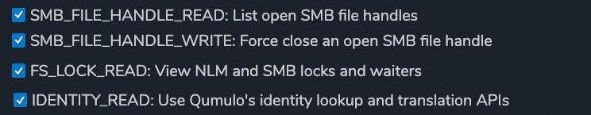

# Qumulo SMB Lock Manager - Docker Deployment

## Installation

**These directions assume your host has network access to `hub.docker.com`**

- Download or clone all files in the DOCKER directory
- Edit `/app/async_main.conf` with your information
- Edit `dockerfile` and `docker-compose.yml` if you'd like to use a different TCP port than 4000
- `cd` into the `DOCKER` directory and build the application with `docker-compose build --no-cache`
- Run the application with `docker compose up` add the option `--detach` if you'd like to run it in the background

**Multiple user accounts are now supported, but please note that old style .conf files are no longer valid**
**Please refer to the provided `async_main.conf` file for an example of the new format**

## Upgrading

You can upgrade the version of `qumulo-lock-mgr` being run by redeploying with the `:latest` tag.

You can browse to see if there are any updates here:

https://hub.docker.com/repository/docker/jcostaasc/qumulo-lock-mgr/tags

You might need to purge your Docker caches to have it pick up the any new versions.

The quickest way to do this is with `docker system prune -f` ,but be aware of the scope of running this command in your system.

## Access Denied error troubleshooting

If you see the error **"Access Denied to this Resource"** then please ensure you have all required RBAC rights:

